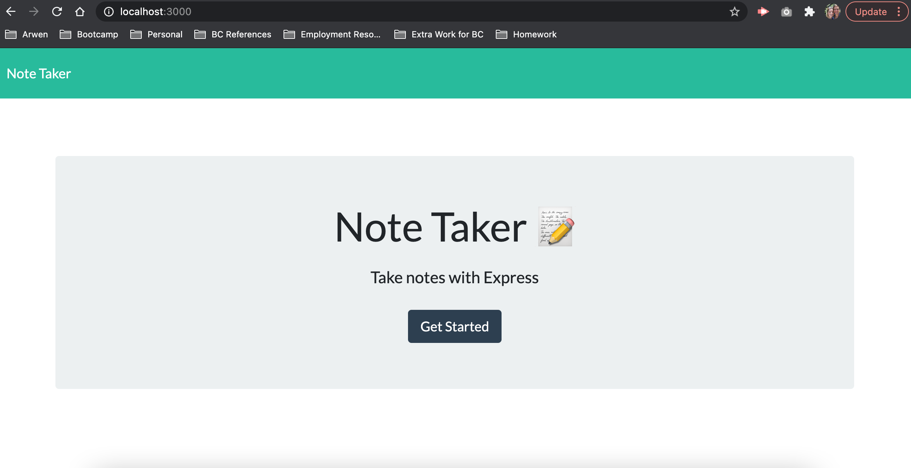
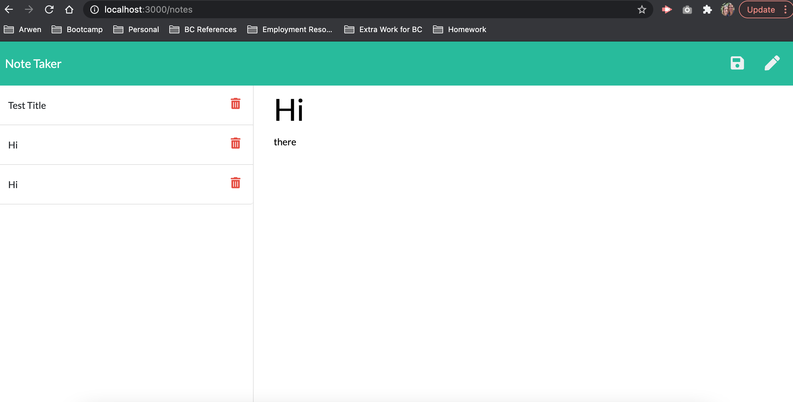

# Note Taker
## Table of Contents

1. [Description](#description)
2. [Contributing](#contributers)
3. [License](#license)

### Description
This app can be used to write and save notes using Express.js.

**Application in Progress**

**Final Product**

[Link to Application](https://github.com/rachelamos/note-taker.git)

[Demo of My App](https://drive.google.com/file/d/1ePgoerPlSF9h5pSY30RvkDtDv6Tdqgcz/view)

### Questions
If you have any other questions, you can reach me:
- via email: rachelamos35@gmail.com
- via GitHub: https://github.com/rachelamos

### License
This project is covered under the [MIT](LICENSE) license.

### Contributers
© Rachel Amos
